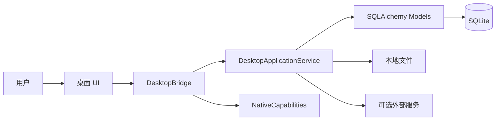

# R/LAB 项目架构

本文只描述公开的技术结构、运行边界和代码职责，不记录开发对话、任务流水、个人数据或内部验证材料。

## 1. 系统形态

R/LAB 是本地优先的单用户科研工作台。Windows 桌面版以 `pywebview + WebView2` 加载本地 HTML、CSS 和 JavaScript，通过进程内 JavaScript Bridge 调用 Python 服务。正式桌面入口不启动 HTTP Server，也不监听 TCP 端口。



仓库仍保留 Flask/Jinja 页面和 `run.py`，用于兼容既有工作流、测试和可选 Web 部署。新增桌面产品能力应进入共享服务层，不能在 Flask 路由中复制一套业务规则。

## 2. 运行入口

### 桌面入口

```text
desktop_main.py
  -> app.desktop.runtime.main()
  -> 配置本地目录和日志
  -> 初始化 Flask application context
  -> 迁移前备份并执行数据库迁移
  -> 创建 DesktopApplicationService
  -> 创建 DesktopBridge
  -> pywebview 加载 app/desktop_ui/index.html
```

- `desktop_main.py`：正式桌面入口。
- `desktop_launcher.py`：旧快捷方式和构建脚本的兼容入口。
- `app/desktop/runtime.py`：环境、日志、迁移和窗口生命周期。
- `app/desktop/single_instance.py`：桌面单实例控制。
- `app/desktop/bridge.py`：命令白名单和统一响应封装。
- `app/desktop/native.py`：文件选择、目录打开、保存和窗口能力。

### Web 兼容入口

```text
run.py
  -> app.create_app()
  -> 数据库迁移
  -> Flask Server
```

`app/__init__.py` 负责 SQLAlchemy、Flask-Migrate、登录、CSRF、限流、安全响应头、蓝图和 CLI 配置。Web 入口属于兼容层，不能成为桌面功能的第二套实现。

## 3. 目录职责

```text
research_assistant/
├── app/
│   ├── desktop/                 # 桌面运行时、Bridge 和原生能力
│   ├── desktop_ui/              # 正式桌面前端
│   ├── services/                # 与界面和请求无关的业务服务
│   ├── static/                  # Web 静态资源和第三方前端资源
│   ├── templates/               # Flask/Jinja 兼容页面
│   ├── models.py                # SQLAlchemy 数据模型
│   ├── main.py                  # 主要 Flask 兼容路由
│   └── workspace.py             # 工作区相关兼容路由
├── migrations/                  # Alembic 数据库迁移
├── tests/                       # 单元、集成、迁移和桌面契约测试
├── packaging/                   # 平台打包与安装逻辑
├── scripts/                     # 构建和校验脚本
├── release/                     # 正式发布产物及校验值
├── workspace-template/          # 可复制的科研工作区模板
├── desktop_main.py              # 正式桌面入口
├── run.py                       # Web 兼容入口
└── requirements*.txt            # 运行、生产和构建依赖
```

`instance/`、`tmp/`、`build/` 和 `dist/` 是本地数据或可再生成目录，不属于源码，也不应提交用户数据。

## 4. 分层边界

| 层 | 位置 | 职责 |
|---|---|---|
| 桌面表现层 | `app/desktop_ui/` | 页面布局、交互、表单、列表、分页和本地状态 |
| 桌面适配层 | `app/desktop/bridge.py` | 命令白名单、协议版本、参数和统一错误 |
| 原生适配层 | `app/desktop/native.py` | 受控访问操作系统文件和窗口能力 |
| 应用服务层 | `app/services/` | 输入校验、事务、工作区隔离、并发控制和 DTO |
| Web 兼容层 | `app/main.py`、`app/workspace.py`、模板和静态资源 | 既有 Flask/Jinja 工作流 |
| 持久化层 | `app/models.py` | 领域实体、关系、软删除、时间戳和行版本 |
| 基础设施层 | `migrations/`、各专项 service | 迁移、备份、导出、AI、邮件、更新和外部集成 |

允许的主要依赖方向：

```text
desktop_ui -> DesktopBridge -> app/services -> app/models
                         \-> NativeCapabilities

Flask routes -> shared services/models
```

Bridge 只做协议适配，不承载领域规则；UI 不直接访问数据库；业务校验和事务必须位于服务层。

## 5. 核心领域

```text
Workspace
└── ResearchProject
    ├── LabRecord
    │   ├── LabRecordStep
    │   ├── LabRecordEvent
    │   ├── LabRecordParameter
    │   ├── LabRecordMaterial
    │   └── LabRecordRevision
    ├── LiteratureItem
    ├── LibraryItem
    ├── Note
    ├── Task
    ├── CalendarEvent
    └── WeeklyReport
```

横向能力包括标签、全文搜索、活动记录、AI 助手、Zotero 连接和工作区设置。旧版 `Experiment`、`ExperimentBatch` 与 `ExperimentRecord` 模型继续用于兼容历史数据和页面。

新增桌面业务默认使用 `ResearchProject -> LabRecord` 主链路。删除旧模型或旧路由前，必须先完成历史数据库迁移和恢复验证。

## 6. 关键流程

### 桌面查询和写入

```text
UI 构造命令和 payload
  -> DesktopBridge.invoke()
  -> 命令白名单分发
  -> DesktopApplicationService 校验 workspace、ID 和 row_version
  -> SQLAlchemy 查询或事务
  -> 返回可序列化 DTO
  -> Bridge 封装统一响应
  -> UI 更新状态
```

写操作使用 `row_version` 进行乐观并发控制。服务层负责提交或回滚事务，UI 不能根据本地状态假设写入成功。

### 文件管理

托管文件由应用复制到本地数据目录并维护元数据；外部文件只保存受控路径和完整性信息。所有文件系统操作必须经过路径校验。

### AI 辅助

AI 是可选基础设施。服务层限制允许写入的目标和字段，生成结果只有在用户确认后才能应用。AI 生成值与真实实验测量值必须区分，API 凭据不得进入前端资源、日志或仓库。

### 数据库升级

```text
桌面启动
  -> 定位本地数据目录
  -> 备份现有数据库
  -> 执行 migrations/
  -> 启动桌面界面
```

数据库结构变化必须新增 Alembic 迁移，并覆盖历史数据库升级测试，不能只修改 `models.py`。

## 7. 本地数据与隐私

桌面版默认数据位置：

```text
%LOCALAPPDATA%/ResearchAssistant/
├── data/                        # SQLite、托管文件和迁移状态
├── logs/desktop.log             # 桌面日志
└── webview-profile/             # WebView2 本地配置
```

- 安装和升级不得删除 `data/`。
- 用户数据库、附件、备份、对话内容、API Key 和 `.env` 不进入发布仓库。
- API 凭据由本地密钥机制保护，不能写入 JavaScript、日志或导出模板。
- 外部 URL 和 AI API 地址必须通过安全配置校验。

## 8. 修改指南

| 修改类型 | 主要位置 | 必需验证 |
|---|---|---|
| 桌面交互 | `app/desktop_ui/` | JavaScript 语法、桌面交互和响应式检查 |
| Bridge 命令 | `app/desktop/bridge.py`、协议文件、UI 调用方 | 请求契约、错误码和兼容测试 |
| 业务规则 | `app/services/` | 服务单元测试和端到端用例 |
| 数据结构 | `app/models.py`、新迁移 | 升级、降级和历史数据测试 |
| Web 兼容修复 | Flask 路由、模板、静态资源 | 现有 Web 测试，不复制服务规则 |
| 安装和升级 | `packaging/`、`scripts/` | 安装、升级、数据保留和校验值 |

新增功能时遵循以下约束：

1. 桌面 UI 只调用 Bridge 已登记命令。
2. Bridge 保持轻量，只处理协议和原生能力协调。
3. 服务层统一负责验证、事务、权限边界和 DTO。
4. 模型变化同时提供迁移和测试。
5. 桌面正式入口不得新增 HTTP 监听器。
6. 发布前只提交源码、必要架构、测试、用户文档和正式资源，不提交开发对话或本地过程记录。

## 9. 验证命令

```powershell
# Python 测试
.\.venv\Scripts\python.exe -m pytest -q

# 桌面 JavaScript
node --check app\desktop_ui\desktop.js
node --check app\desktop_ui\desktop_research.js
node --check app\desktop_ui\desktop_resources.js
node --check app\desktop_ui\desktop_planning.js
node --check app\desktop_ui\desktop_system.js

# Windows 安装包
.\scripts\build_windows_installer.ps1
```

发布时应同时校验安装包哈希，并确认发布差异中没有本地数据库、附件、凭据、个人路径、开发对话或过程记录。
